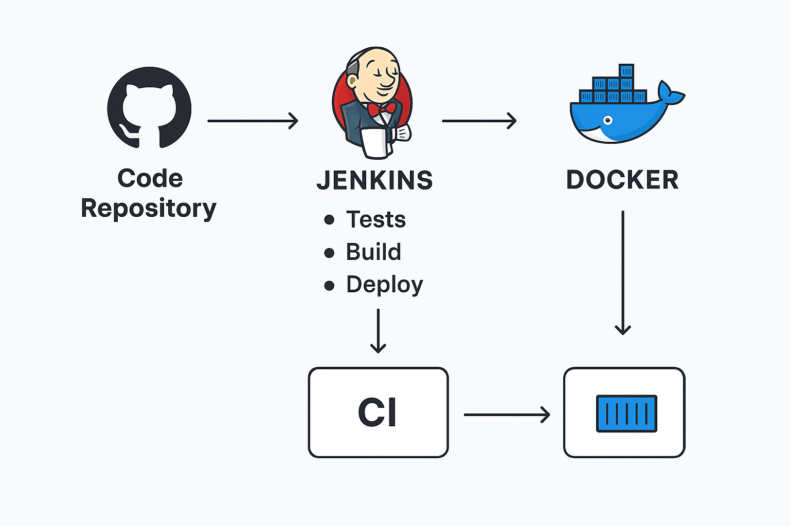

# Messaging API

A robust and scalable RESTful API built with Django and Django REST Framework for managing user messaging conversations and messages. This project demonstrates best practices in API development including model design, serializers, viewsets, and clean URL routing.

---

## Overview

This project implements a messaging system backend API that allows users to create conversations, send messages, and manage user roles and profiles. It follows Django's best practices for project structure and RESTful API design.

---

## Features

* User management with roles (`guest`, `host`, `admin`)
* Conversations with multiple participants
* Sending and retrieving messages within conversations
* UUID primary keys for all models
* Timestamp fields with automatic creation times
* Nested serialization for conversations including messages

---

## Tech Stack

* Python 3.11+
* Django 5.x
* Django REST Framework
* MySQL 8 (configurable; SQLite default for local dev)
* Docker & Docker Compose
* Jenkins (for CI/CD)
* GitHub Actions (CI/CD)
* `django-environ` for environment variables

---

## Setup and Installation

You can run the project either **locally using Python virtual environment (venv)** or **inside Docker containers**.

---

### Option 1: Local Setup (venv)

```bash
# Clone the repo
git clone https://github.com/yourusername/messaging_api.git
cd messaging_app

# Create virtual environment
python -m venv venv

# Activate virtual environment
# Windows (PowerShell)
.\venv\Scripts\Activate.ps1
# Linux/Mac
source venv/bin/activate

# Install dependencies
pip install -r requirements.txt

# Apply migrations
python manage.py migrate

# Create superuser (optional)
python manage.py createsuperuser

# Run development server
python manage.py runserver
```

---

### Option 2: Docker Setup

#### Prerequisites

* Docker installed ([Get Docker](https://docs.docker.com/get-docker/))
* Docker Compose installed
* A `.env` file placed one directory above the project root with content like:

```env
MYSQL_ROOT_PASSWORD=your_root_password
MYSQL_DATABASE=messagingdb
MYSQL_USER=your_db_user
MYSQL_PASSWORD=your_db_password
DJANGO_SECRET_KEY=your_django_secret_key
DJANGO_ALLOWED_HOSTS=localhost,127.0.0.1,0.0.0.0
```

#### Steps

```bash
# Clone the repo
git clone https://github.com/yourusername/messaging_api.git
cd messaging_api

# Build and start containers
docker compose --env-file ../.env up --build

# Run migrations inside the Django container
docker compose exec web python manage.py migrate

# (Optional) Create superuser inside the container
docker compose exec web python manage.py createsuperuser

# Access the app at http://localhost:8000/
```

---

## Project Structure

```
messaging_app/
├── chats/
│   ├── migrations/
│   ├── __init__.py
│   ├── admin.py
│   ├── apps.py
│   ├── models.py
│   ├── serializers.py
│   ├── tests.py
│   ├── urls.py
│   └── views.py
├── messaging_app/
│   ├── __init__.py
│   ├── asgi.py
│   ├── settings.py
│   ├── urls.py
│   └── wsgi.py
├── manage.py
├── requirements.txt
├── Jenkinsfile
└── .github/workflows/
    ├── ci.yml
    └── dep.yml
```

---

## CI/CD with Jenkins

The project includes a **Jenkins pipeline** to automate testing, Docker builds, and deployment.

### Jenkins Setup

```bash
docker run -d --name jenkins -p 8081:8080 -p 50000:50000 \
  -v jenkins_home:/var/jenkins_home \
  -v /var/run/docker.sock:/var/run/docker.sock \
  jenkins/jenkins:lts
```

* **Access Dashboard:** `http://localhost:8081`
* **Install Plugins:** Git, Pipeline, ShiningPanda
* **Add Credentials:** GitHub personal access token, Docker Hub access token

### Pipeline Stages

1. **Checkout:** Pulls code from GitHub using credentials.
2. **Install Dependencies:** Installs Python packages from `requirements.txt`.
3. **Run Tests:** Executes `pytest` and generates JUnit reports.
4. **Build Docker Image:** Builds the messaging app Docker image.
5. **Push Docker Image:** Pushes the image to Docker Hub using personal access token.

---

## CI/CD with GitHub Actions

The project includes **GitHub Actions workflows** to automate testing and Docker deployment.

### `ci.yml` Workflow

* Runs on **push** and **pull request** events
* Installs dependencies
* Sets up MySQL service
* Runs `pytest`
* Runs `flake8` for linting
* Generates and uploads test coverage reports

### `dep.yml` Workflow

* Builds Docker image for the messaging app
* Pushes the image to Docker Hub using GitHub secrets for authentication

---



## Models

### User

* UUID primary key (`user_id`)
* `first_name`, `last_name`, `email` (unique)
* `phone_number` (optional)
* `role` (`guest`, `host`, `admin`)
* `created_at` timestamp

### Conversation

* UUID primary key (`conversation_id`)
* `participants` (many-to-many with User)
* `created_at` timestamp

### Message

* UUID primary key (`message_id`)
* `sender` (foreign key to User)
* `conversation` (foreign key to Conversation)
* `message_body` (text)
* `sent_at` timestamp

---

## API Endpoints

| Method | Endpoint                   | Description                   |
| ------ | -------------------------- | ----------------------------- |
| GET    | `/api/conversations/`      | List all conversations        |
| POST   | `/api/conversations/`      | Create a new conversation     |
| GET    | `/api/conversations/{id}/` | Retrieve conversation details |
| GET    | `/api/messages/`           | List all messages             |
| POST   | `/api/messages/`           | Send a new message            |
| GET    | `/api/messages/{id}/`      | Retrieve message details      |

---

## Testing

```bash
# Local tests
python manage.py test

# Jenkins/GitHub Actions automatically run tests in CI
```

---

## Accessing the API


| Access Method          | How to Access                                                          | Authentication Used              |
| ---------------------- | ---------------------------------------------------------------------- | -------------------------------- |
| **Browser / UI**       | Visit `/api/` and login                                                | Session Authentication (cookies) |
| **Programmatic (API)** | Use `/api/token/` to get JWT token and pass it in Authorization header | JWT Token Authentication         |

---

If you’re seeing errors, make sure:

* You have users created with correct credentials.
* Your URLs include both `api-auth/` and JWT token endpoints.
* Your `REST_FRAMEWORK` settings include `SessionAuthentication` and `JWTAuthentication`.

---
```bash
curl -H "Authorization: Bearer <your_access_token>" http://127.0.0.1:8000/api/conversations/
```

---

This README now documents **local setup, Docker setup, Jenkins CI/CD, and GitHub Actions CI/CD** all in one place.

---


